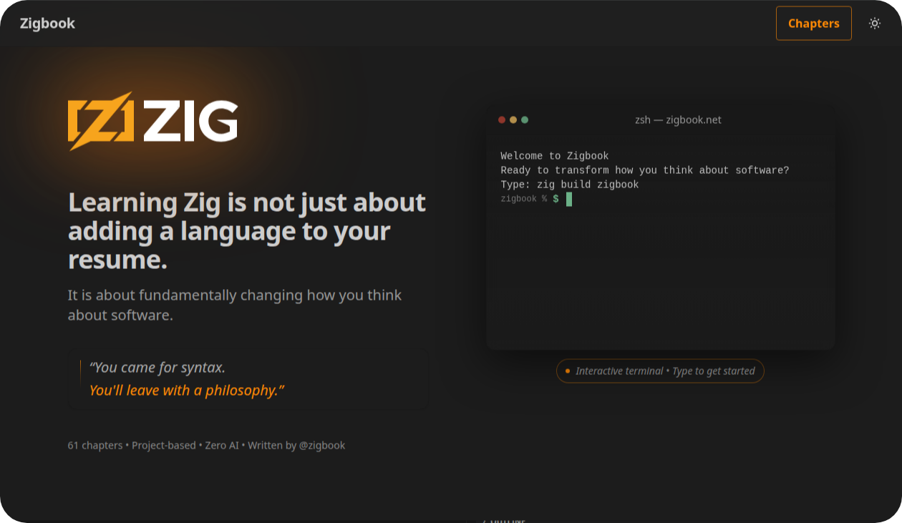

// Enable keyboard shortcuts
:experimental:

:toc: macro
:toc-title: Summary
:toclevels: 3

ifndef::env-github[:icons: font]
ifdef::env-github[]
:status:
:outfilesuffix: .adoc
:caution-caption: :fire:
:important-caption: :exclamation:
:note-caption: :paperclip:
:tip-caption: :bulb:
:warning-caption: :warning:
endif::[]

:back_to_top_target: top-target
:back_to_top_label: ⬆ Back to top
:back_to_top: <<{back_to_top_target},{back_to_top_label}>>

image:https://img.shields.io/github/stars/zigbook/zigbook?style=for-the-badge[GitHub Stars]
image:https://img.shields.io/badge/Zig-Book-color?style=for-the-badge&logo=zig&color=%23f3ab20[zigbook.net]

&nbsp;
&nbsp;

&nbsp;

[quote]
____
Learning Zig is not just about adding a language to your resume.

You came for syntax. You'll leave with a philosophy.
____

Zigbook is a comprehensive, project-based guide to the Zig programming language — a journey from fundamentals to advanced systems programming, published online at https://zigbook.net[]. It is is designed with a pedagogical approach that builds upon previously learned concepts, rather than presenting a disconnected grab-bag of fractured examples. 

This repository contains the source for the Zigbook site and the code that powers its examples.

== What is Zigbook?

Zigbook is a structured path through Zig, with more than sixty chapters that alternate between:

* *Concept chapters* – introducing core language ideas with clear, focused explanations.
* *Project chapters* – building real tools, utilities, and systems in Zig so concepts stick.

Chapters range from control flow and data fundamentals all the way to:

* custom allocators and memory management
* build system deep dives and multi-package workspaces
* concurrency, threads, and atomics
* HTTP, JSON, and networked services
* C and GPU interop
* profiling, optimization, and hardening
* a curated tour of the Zig standard library

The goal is not just to teach *what* Zig can do, but *why* it works the way it does and how to reason about systems code with complete confidence.

IMPORTANT: *link:https://zigbook.net[The Zigbook]* intentionally contains *no* AI-generated content—it is hand-written, carefully curated, and continuously updated to reflect the latest language features and best practices.

This repository exists to make that work transparent, reviewable, and easy for the community to improve.

== Who is this for?

Zigbook is designed for developers who:

* already know at least one programming language
* are curious about systems programming, even if Zig is their first systems language
* value clarity, explicit control, and understanding over “just make it work”
* come from C, C++, Rust, Go, or higher-level languages and want to see how systems look in Zig

You do *not* need to be a kernel wizard to start, but you should be comfortable with a terminal and willing to think carefully about memory, errors, and control flow.

== Reading the book

The best way to experience Zigbook is on the live site:

* Online: https://zigbook.net/[]

I encourage you to work through the zigbook sequentially from beginning to end rather than jumping around. The structure is intentionally progressive, with each chapter building on previous ones. Once you've completed a full read-through, it becomes a much more effective reference tool. 

== Repository overview

This repository powers https://zigbook.net/[the Zigbook] and includes:

* `app/`, `pages/` – the Next.js application that renders the book and site.
* `chapters-data/` – structured content and metadata for chapters.
* `components/` – UI components used across the site.
* `lib/` – shared utilities and helpers.
* `public/` – static assets.
* `scripts/` – maintenance, generation, and utility scripts.
* `.zigversion` – the recommended Zig compiler version for this project.
* `llms.txt` – rules and context for automated tools.
* `README.adoc` – you are here.

_Exact internals may evolve as the book grows, but the intent is to keep the structure friendly for contributors._

== Running the site locally

You can run the Zigbook site locally to hack on the content or implementation.

=== Prerequisites

* Node.js (LTS or newer)
* Zig (see the `.zigversion` file for the recommended version)
* A package manager: `npm`, `pnpm`, or `yarn`

=== Setup

[source,shell]
----
git clone https://github.com/zigbook/zigbook.git
cd zigbook

# Install dependencies (pick one)
pnpm i
# or: npm install
# or: yarn install
----

=== Development server

[source,shell]
----
# Start a local dev server (Next.js)
pnpm dev
# or the equivalent npm / yarn command
----

The site will typically be available at http://localhost:3000/[].

You can now edit chapters, components, and styles and see changes live.

=== Production build

[source,shell]
----
pnpm build
pnpm start
----

This runs the site as a production build, similar to how it is deployed for https://zigbook.net/[].

== Contributing

Zigbook is intentionally community-friendly. Contributions are welcome in many forms:

* fixing typos, grammar, and clarity issues
* improving explanations or adding carefully chosen examples
* refining projects to better demonstrate a concept
* adding links to relevant Zig ecosystem tools and libraries
* improving accessibility, navigation, or UX of the site

=== Contribution guidelines

To open a contribution:

. Check existing https://github.com/zigbook/zigbook/issues[issues] to avoid duplicates.
. If you’re proposing a larger change, open an issue first to discuss direction.
. Submit a pull request with a clear description of:
  * what you changed
  * why you changed it
  * how it improves the learning experience

Please keep in mind:

* *Human-written only.* The book content itself is deliberately free of AI-generated prose. Drafts may start anywhere, but final text should be reviewed, edited, and owned by a human contributor.
* *Consistency over cleverness.* Match the voice and structure of existing chapters. The goal is for readers to feel a consistent narrative from start to finish.
* *Teaching first.* Prefer explanations and examples that help the reader understand tradeoffs, not just memorise syntax.

The maintainer reviews every submission personally to keep the quality and tone aligned with the rest of the book.

== Issue types

Common issue types that are especially helpful:

* `docs: typo` – spelling, grammar, formatting fixes.
* `docs: clarification` – confusing paragraphs or missing context.
* `docs: example` – broken code examples or mismatched output.
* `book: structure` – feedback on chapter ordering or progression.
* `site: bug` – rendering issues, navigation problems, or broken links.
* `site: enhancement` – UX, search, or performance improvements.

Clear, focused issues make it easier for both maintainers and new contributors to help.

== Roadmap (high-level)

As the Zig ecosystem evolves, Zigbook aims to:

* track new Zig releases and keep examples current
* expand coverage of the standard library and ecosystem tools
* deepen project chapters that mirror real-world usage
* refine explanations based on community feedback

For concrete plans and in-progress work, see the https://github.com/zigbook/zigbook/issues[issue tracker] and any open milestones.

== A note to readers

Zig is still a young language, and its world is changing fast. Zigbook is meant to be a living document that grows alongside the language — a place where the community captures hard-earned understanding and makes it approachable for the next wave of systems programmers.

If Zig has ever made you think, “I wish someone would explain this *properly*,” this project is that wish, written down in code and prose.

{back_to_top}